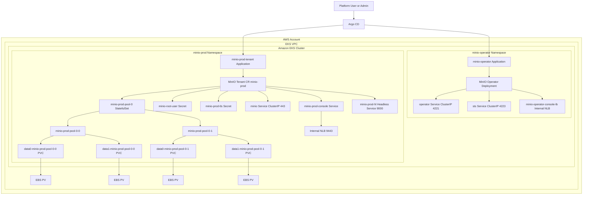

# MinIO Operator and Tenant on EKS with Argo CD

This repository contains the Kubernetes and Argo CD manifests used to run MinIO Operator and a production-style MinIO Tenant on Amazon EKS.

For teardown steps, see [CLEANUP.md](D:/D/POCS/Gitlab_ArgoCD_EKS_MultiEnv/CLEANUP.md).

## Overview

The setup is split into two Argo CD applications:

- `minio-operator`
  Deploys the MinIO Operator Helm chart into namespace `minio-operator`.
- `minio-prod-tenant`
  Deploys the MinIO Tenant Helm chart into namespace `minio-prod`.

The tenant uses EBS-backed PVCs with a dedicated `StorageClass` and is managed declaratively through Argo CD.

## Architecture Diagram



### Architecture Notes

- Argo CD manages both the operator and the tenant as separate applications.
- MinIO Operator runs in namespace `minio-operator` and reconciles the `Tenant` custom resource in namespace `minio-prod`.
- The tenant runs as a StatefulSet with 2 MinIO pods and 4 EBS-backed PVCs.
- The tenant console is exposed through an internal AWS NLB.
- The operator console is exposed through a separate internal AWS NLB service.
- The MinIO S3 API remains internal-only through the `minio` ClusterIP service.

## Repository Layout

- [minio-operator-app.yaml](D:/D/POCS/Gitlab_ArgoCD_EKS_MultiEnv/minio-operator-app.yaml)
  Argo CD `Application` for the MinIO Operator.
- [minio-tenant-app.yaml](D:/D/POCS/Gitlab_ArgoCD_EKS_MultiEnv/minio-tenant-app.yaml)
  Argo CD `Application` for the MinIO production tenant.
- [minio-operator-console-lb.yaml](D:/D/POCS/Gitlab_ArgoCD_EKS_MultiEnv/minio-operator-console-lb.yaml)
  Internal AWS NLB Service for the operator console.
- [minio-gp3-retain-sc.yaml](D:/D/POCS/Gitlab_ArgoCD_EKS_MultiEnv/minio-gp3-retain-sc.yaml)
  EBS CSI `StorageClass` used by the tenant.
- [minio/tenant/minio-prod-tenant-values.yaml](D:/D/POCS/Gitlab_ArgoCD_EKS_MultiEnv/minio/tenant/minio-prod-tenant-values.yaml)
  Local tenant values file aligned with the live tenant app.

## How It Runs on EKS

### Operator

- Namespace: `minio-operator`
- Source chart: `https://operator.min.io`
- Chart: `operator`
- Version: `7.1.1`

The operator is deployed as a standard EKS workload and watches MinIO `Tenant` custom resources.

### Tenant

- Namespace: `minio-prod`
- Source chart: `https://operator.min.io`
- Chart: `tenant`
- Version: `7.1.1`

Current tenant characteristics:

- Tenant name: `minio-prod`
- Pool name: `pool-0`
- Servers: `2`
- Volumes per server: `2`
- Volume size: `250Gi`
- StorageClass: `minio-gp3-retain`
- Auto TLS enabled: `true`
- Console exposed through internal NLB
- S3 API remains internal-only

### Storage

The tenant uses AWS EBS volumes provisioned by the EBS CSI driver through:

- `StorageClass`: `minio-gp3-retain`
- `reclaimPolicy: Retain`
- `volumeBindingMode: WaitForFirstConsumer`

This means MinIO data is stored on persistent EBS volumes and survives MinIO pod restarts.

## Argo CD Management

Apply the Argo CD applications with:

```powershell
kubectl apply -f minio-operator-app.yaml
kubectl apply -f minio-tenant-app.yaml
kubectl apply -f minio-operator-console-lb.yaml
```

Check application health:

```powershell
kubectl -n argocd get application
kubectl -n argocd get application minio-operator -o yaml
kubectl -n argocd get application minio-prod-tenant -o yaml
```

Expected state:

- `minio-operator`: `Healthy`, `Synced`
- `minio-prod-tenant`: `Healthy`, `Synced`

## Access Model

### Operator Console

The operator console is exposed through an internal AWS NLB:

```powershell
kubectl -n minio-operator get svc minio-operator-console-lb -o wide
```

### Tenant Console

The tenant console is exposed through an internal AWS NLB:

```powershell
kubectl -n minio-prod get svc minio-prod-console -o wide
```

### Important

These are internal load balancers. They are reachable only from inside the VPC, or from a network connected to the VPC.

If needed, use:

- a bastion host
- VPN / Direct Connect
- `kubectl port-forward`

## Current Tenant Credentials

The current tenant root credentials are configured in the tenant secret:

- Username: `minioadmin`
- Password: `minioadmin123`

Read them from the cluster:

```powershell
kubectl -n minio-prod get secret minio-root-user -o jsonpath="{.data.config\.env}"
```

Decode on PowerShell:

```powershell
[System.Text.Encoding]::UTF8.GetString([System.Convert]::FromBase64String((kubectl -n minio-prod get secret minio-root-user -o jsonpath="{.data.config\.env}")))
```

For production, move these credentials out of Git and into an external secret manager or SealedSecret workflow.

## Useful kubectl Commands

### Operator

```powershell
kubectl -n minio-operator get deploy,pods,svc
kubectl -n minio-operator logs deploy/minio-operator --tail=100
kubectl get crd | Select-String minio
```

### Tenant

```powershell
kubectl -n minio-prod get tenant,pods,svc,pvc,pv
kubectl -n minio-prod describe tenant minio-prod
kubectl -n minio-prod get events --sort-by=.lastTimestamp
kubectl -n minio-prod logs minio-prod-pool-0-0 -c minio --tail=100
kubectl -n minio-prod logs minio-prod-pool-0-0 -c sidecar --tail=100
```

## PVC and Persistence Operations

MinIO owns the mounted volume paths. The correct way to test PVC-backed storage is through MinIO object operations, then verify the object still exists after a pod restart.

### 1. Check PVCs and PVs

```powershell
kubectl -n minio-prod get pvc
kubectl get pv | Select-String minio-prod
kubectl -n minio-prod describe pvc data0-minio-prod-pool-0-0
kubectl -n minio-prod exec minio-prod-pool-0-0 -c minio -- df -h
```

### 2. Run an in-cluster MinIO client

```powershell
kubectl -n minio-prod run mc --rm -it --restart=Never --image=minio/mc -- sh
```

Inside the pod:

```sh
mc alias set local https://minio.minio-prod.svc.cluster.local minioadmin minioadmin123 --insecure
mc mb local/test-bucket
echo "hello from minio on eks" > /tmp/hello.txt
mc cp /tmp/hello.txt local/test-bucket/hello.txt
mc ls local/test-bucket
mc cat local/test-bucket/hello.txt
mc stat local/test-bucket/hello.txt
```

### 3. Restart one MinIO pod

```powershell
kubectl -n minio-prod delete pod minio-prod-pool-0-0
kubectl -n minio-prod get pods -w
kubectl -n minio-prod get tenant minio-prod -o jsonpath="{.status.currentState}{'|'}{.status.healthStatus}{'|'}{.status.availableReplicas}"
```

Expected healthy result:

```text
Initialized|green|2
```

### 4. Read the same object again

Start a temporary client pod:

```powershell
kubectl -n minio-prod run mc-verify --image=minio/mc --restart=Never --command -- sleep 3600
kubectl -n minio-prod wait --for=condition=Ready pod/mc-verify --timeout=180s
```

Then verify:

```powershell
kubectl -n minio-prod exec mc-verify -- sh -c "mc alias set local https://minio.minio-prod.svc.cluster.local minioadmin minioadmin123 --insecure >/dev/null 2>&1 && mc cat local/test-bucket/hello.txt && echo '---' && mc stat local/test-bucket/hello.txt"
kubectl -n minio-prod delete pod mc-verify --ignore-not-found=true
```

If the same object is still readable after the pod restart, PVC-backed persistence is working correctly.

## Validated Result in This Environment

The following was tested successfully in this cluster:

- tenant health reached `Initialized`
- object upload succeeded
- object read succeeded
- MinIO pod restart succeeded
- same object remained readable after restart

That confirms:

- tenant is functional
- EBS-backed PVCs are bound and mounted correctly
- MinIO data persists after pod replacement

## Notes

- The tenant console is exposed through an internal NLB only.
- The tenant S3 API is not externally exposed.
- The operator console is also internal-only.
- CPU requests were lowered to fit the current EKS node sizes:
  - request: `1000m`
  - limit: `2`

If node capacity increases later, these values can be raised again based on load testing.
